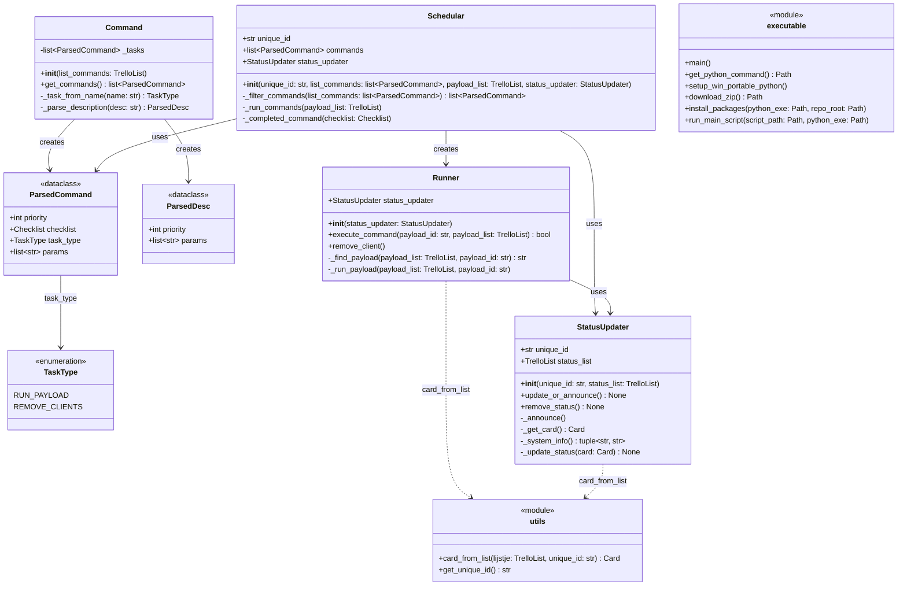

# botnet

## UML Class Diagram

```mermaid
classDiagram
    direction TB

    class TaskType {
        <<enumeration>>
        RUN_PAYLOAD
        REMOVE_CLIENTS
    }

    class ParsedCommand {
        <<dataclass>>
        +int priority
        +Checklist checklist
        +TaskType task_type
        +list~str~ params
    }

    class ParsedDesc {
        <<dataclass>>
        +int priority
        +list~str~ params
    }

    class Command {
        -list~ParsedCommand~ _tasks
        +__init__(list_commands: TrelloList)
        +get_commands() list~ParsedCommand~
        -_task_from_name(name: str) TaskType
        -_parse_description(desc: str) ParsedDesc
    }

    class StatusUpdater {
        +str unique_id
        +TrelloList status_list
        +__init__(unique_id: str, status_list: TrelloList)
        +update_or_announce() None
        +remove_status() None
        -_announce()
        -_get_card() Card
        -_system_info() tuple~str, str~
        -_update_status(card: Card) None
    }

    class Runner {
        +StatusUpdater status_updater
        +__init__(status_updater: StatusUpdater)
        +execute_command(payload_id: str, payload_list: TrelloList) bool
        +remove_client()
        -_find_payload(payload_list: TrelloList, payload_id: str) str
        -_run_payload(payload_list: TrelloList, payload_id: str)
    }

    class Schedular {
        +str unique_id
        +list~ParsedCommand~ commands
        +StatusUpdater status_updater
        +__init__(unique_id: str, list_commands: list~ParsedCommand~, payload_list: TrelloList, status_updater: StatusUpdater)
        -_filter_commands(list_commands: list~ParsedCommand~) list~ParsedCommand~
        -_run_commands(payload_list: TrelloList)
        -_completed_command(checklist: Checklist)
    }

    class utils {
        <<module>>
        +card_from_list(lijstje: TrelloList, unique_id: str) Card
        +get_unique_id() str
    }

    class executable {
        <<module>>
        +main()
        +get_python_command() Path
        +setup_win_portable_python()
        +download_zip() Path
        +install_packages(python_exe: Path, repo_root: Path)
        +run_main_script(script_path: Path, python_exe: Path)
    }

    ParsedCommand --> TaskType : task_type
    Command --> ParsedCommand : creates
    Command --> ParsedDesc : creates
    Schedular --> ParsedCommand : uses
    Schedular --> Runner : creates
    Schedular --> StatusUpdater : uses
    Runner --> StatusUpdater : uses
    Runner ..> utils : card_from_list
    StatusUpdater ..> utils : card_from_list
```
